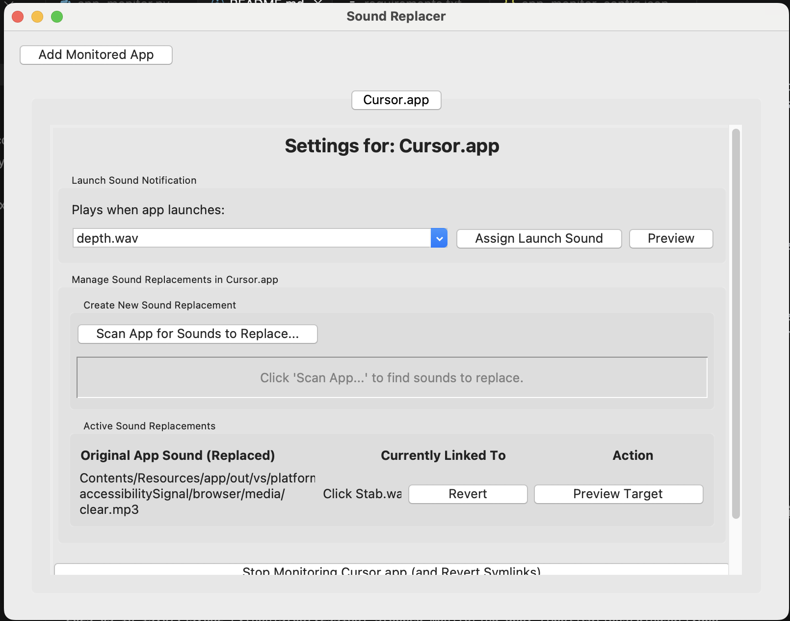

# Sound Replacer

Sound Replacer is a macOS application that allows you to monitor application launches, trigger custom sound notifications, and replace an application's internal sound files with your own preferred sounds using symlinks.



## Features

*   **App Launch Sound Notifications:** Play a selected sound from your `sounds` directory whenever a monitored application is launched.
*   **Sound Replacement (Symlinking):**
    *   Scan application bundles (like `.app` files) for existing sound files.
    *   Replace any of an app's internal sounds with a symlink to a custom sound file you choose.
    *   Original application sound files are automatically backed up (e.g., `original.mp3` becomes `original.mp3.bak`) before being replaced by a symlink.
    *   Manage all sound replacements on a per-application basis through a tabbed interface.
    *   Easily preview original and target sounds.
    *   Revert symlinks to restore original application sounds from backups.
*   **Configuration Management:**
    *   All settings (monitored apps, launch sounds, active symlinks) are saved to `app_monitor_config.json`.
    *   Settings are loaded on startup and can be saved manually or automatically on exit.

## Setup

1.  **Environment:**
    *   This application is designed for macOS.
    *   Python 3 is required.
2.  **Dependencies:**
    *   It's highly recommended to use a Python virtual environment.
        ```bash
        python3 -m venv venv
        source venv/bin/activate 
        ```
    *   Install the required packages:
        ```bash
        pip install -r requirements.txt
        ```
3.  **Sounds Directory:**
    *   Create a directory named `sounds` in the same folder as the `app_monitor.py` script.
    *   Place your custom sound files (e.g., `.mp3`, `.wav`) into this `sounds` directory. These sounds will be available in the application for launch notifications and as replacement targets.

## How to Use

1.  **Run the Application:**
    ```bash
    python app_monitor.py
    ```

2.  **Adding an App for Monitoring:**
    *   Click the "Add Monitored App" button at the top left.
    *   In the file dialog, navigate to and select the application bundle you want to monitor (e.g., `Cursor.app` from your `/Applications` folder).
    *   A new tab for the selected application will appear in the main window.

3.  **Configuring Launch Sound:**
    *   Select the tab for the desired application.
    *   In the "Launch Sound Notification" section:
        *   The dropdown list shows sounds from your `sounds` directory (and "None").
        *   Select a sound you want to play when this app launches.
        *   Click "Assign Launch Sound" to save this preference.
        *   Click "Preview" to hear the currently selected sound from the dropdown.

4.  **Managing Sound Replacements (Symlinks):**
    *   Navigate to the application's tab.
    *   Locate the "Manage Sound Replacements in [App Name]" section.

    *   **A. Scan for Sounds to Replace:**
        *   Click the "Scan App for Sounds to Replace..." button.
        *   The application will first attempt to scan the default `Contents/Resources` path within the app bundle.
        *   If no sounds are found, or if the sounds you wish to replace are located elsewhere within the app bundle (e.g., within a framework), a dialog will appear. You can then enter a custom relative path (e.g., `Contents/Frameworks/MyFramework.framework/Versions/A/Resources`).
        *   A list of discoverable sound files within the specified path (and its subfolders) will be displayed under "App Sound File (Original)".

    *   **B. Replacing an App's Sound:**
        *   For each sound listed from the app:
            *   **Original Sound:** The path (relative to the app bundle) of the sound is shown. Click "Preview Original" to listen to it.
            *   **Your Sound (Target):**
                *   Click "Browse..." to open a file dialog. Select the custom sound file you want to use as the replacement.
                *   The path of your chosen sound will be displayed. Click "Preview Target" to listen to your selected sound.
            *   **Action:** Click "Replace".
                *   The application will first back up the original app sound (e.g., `original.mp3` to `original.mp3.bak`).
                *   Then, it will create a symbolic link from the original sound's path to your chosen target sound.
                *   A success message will appear, and the "Active Sound Replacements" list will update.

    *   **C. Viewing and Reverting Active Replacements:**
        *   The "Active Sound Replacements" section lists all sounds within the current application that you have replaced.
        *   **Original App Sound (Replaced):** Shows the path of the sound within the app that has been symlinked.
        *   **Currently Linked To:** Shows the name of your custom sound file it now points to.
        *   **Action:**
            *   "Revert": Click this to remove the symlink and restore the original sound file from its `.bak` backup.
            *   "Preview Target": Click to play the custom sound that the symlink currently points to.

5.  **Stop Monitoring an App:**
    *   At the bottom of an application's tab, click the "Stop Monitoring [App Name] (and Revert Symlinks)" button.
    *   This will remove the application from the monitored list, close its tab, and attempt to revert all active sound replacements you made for that specific app.

6.  **Save All Settings:**
    *   At the bottom of any application's tab, click the "Save All Settings" button.
    *   This manually saves all current configurations (monitored apps, assigned launch sounds, active symlinks) to the `app_monitor_config.json` file.
    *   Settings are also saved automatically when you close the application window.

## Configuration File

*   The application stores its settings in a JSON file named `app_monitor_config.json`, located in the same directory as the `app_monitor.py` script.
*   This file includes:
    *   `monitored_apps`: A dictionary mapping application paths to their assigned launch sounds.
    *   `applied_file_modifications`: A dictionary detailing each symlink, including the original path, the backup path, and the target custom sound.
    *   `app_default_symlink_sources`: (Currently not fully utilized in UI but planned for storing default target sounds per app).

## Important Notes

*   **Permissions:** Modifying contents of application bundles (especially those in `/Applications`) may require appropriate write permissions. Ensure the script can write to these locations if you intend to replace sounds within them. In some cases, system integrity protection or file ownership might prevent modifications.
*   **Backups:** While the application creates `.bak` files for original sounds, always be cautious when modifying application bundles.
*   **macOS Specific:** Due to its reliance on AppKit and Foundation for application monitoring, this tool is specific to macOS.
*   **Symlink Behavior:** Symlinks point to absolute paths of your target sound files. If you move or delete your target sound files, the symlinks within the applications will break, and the original sounds (if not reverted) will not play, nor will your custom sounds. 